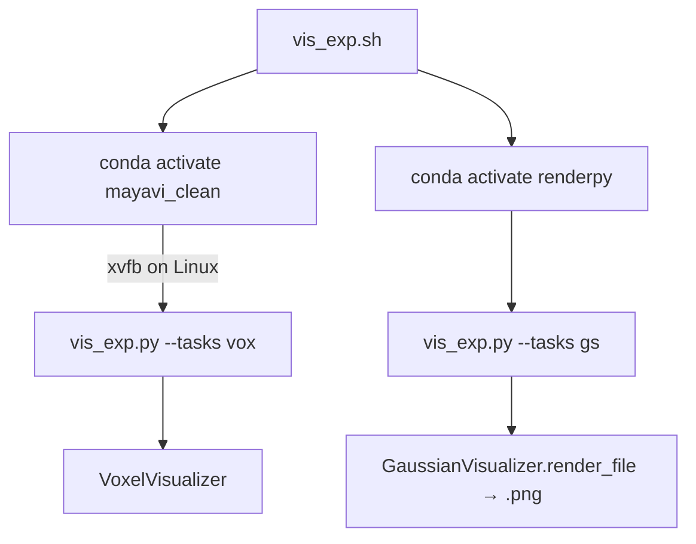

# 完整实验目录一键可视化

## 目标

对单个 epoch 实验目录（如 `/data/exp/embodied/vis/epoch_3/`）批量渲染：

- `vox/global` + `vox/local` → Mayavi PNG（视角分别对齐 `[voxels/vis_occ_glob.py](voxels/vis_occ_glob.py)` / `[voxels/vis_occ.py](voxels/vis_occ.py)`）
- `gs/global` + `gs/local` → Mitsuba PNG（视角分别对齐 `[gaussian/vis_gs_glob.py](gaussian/vis_gs_glob.py)` / `[gaussian/vis_gs.py](gaussian/vis_gs.py)`）

**不处理 `img/` 目录**：不从实验目录复制 RGB，可视化输出目录中也不创建 `img/` 子目录。

**输出格式约束**：所有可视化结果直接落盘为 `.png`，禁止产生 EXR 或任何中间文件（含 `_t.png` 透明衍生图）。

输出路径规则：输入 `.../epoch_3/vox/local/scene0000_00/frame_00000/pred.ply` → 输出 `{OUT_DIR}/vox/local/scene0000_00/frame_00000/pred.png`（保持相对结构，不含 `epoch_3` 前缀，因输入已是单个 epoch 根）。

## 目录与文件布局

在仓库根目录新增：

- `[vis_exp.sh](vis_exp.sh)` — 用户配置入口，**显式切换 conda 虚拟环境** + xvfb 无头渲染
- `[vis_exp.py](vis_exp.py)` — 核心遍历与渲染逻辑




## vis_exp.sh 设计

顶部可配置变量（用户直接编辑）：

```bash
EXP_DIR="/data/exp/embodied/vis/epoch_3"   # 单个 epoch 根目录
OUTPUT_DIR="/data/exp/embodied/vis_render/epoch_3"
VIS_DUAL=true                            # 实验是否开启 dual_vis
SCENES=()                                # 空=全部；或 SCENES=("scene0000_00")
SKIP_EXISTING=true                       # 已存在 PNG 则跳过（支持断点续跑）

# Conda 环境名（固定）
CONDA_ENV_VOX="mayavi_clean"
CONDA_ENV_GS="renderpy"
```

### Conda 环境切换（关键）

脚本通过 `source` conda 初始化后 **分阶段 `conda activate`**，确保 vox 与 gs 使用各自隔离的依赖环境：

```bash
# 初始化 conda（兼容 bash/zsh）
eval "$(conda shell.bash hook)"

# ── Phase 1: Voxel ──
conda activate "$CONDA_ENV_VOX"
# macOS: export DYLD_LIBRARY_PATH="$CONDA_PREFIX/lib:..."
# Linux:  xvfb-run -a python vis_exp.py --tasks vox ...
# macOS:  python vis_exp.py --tasks vox ...
conda deactivate

# ── Phase 2: Gaussian ──
conda activate "$CONDA_ENV_GS"
python vis_exp.py --tasks gs ...
conda deactivate
```

不使用 `conda run` 快捷方式，以 `conda activate` 切换为主路径，行为与用户预期一致。

### 执行流程

1. 校验 `EXP_DIR` 下存在 `vox/` 或 `gs/`（**不检查 img/**）
2. **Vox 阶段**（`mayavi_clean`）：Linux 下用 `xvfb-run` 包裹（复用 `[voxels/vis_occ_rot.sh](voxels/vis_occ_rot.sh)` 模式）；macOS 设置 `DYLD_LIBRARY_PATH`
3. **GS 阶段**（`renderpy`）：直接调用 Python，输出路径后缀为 `.png`

将 `SCENES` 数组展开为 `--scenes scene_a scene_b` 传给 Python；空数组不传则处理全部。

## vis_exp.py 设计

### CLI 接口

```text
python vis_exp.py \
  --exp-dir PATH \
  --output-dir PATH \
  --tasks vox,gs \
  [--vis-dual] \
  [--scenes scene0000_00 ...] \
  [--skip-existing]
```

`--tasks` 仅支持 `vox` 与 `gs`，**无 `img` 任务**。

### 目录遍历规则

以 `exp_dir` 为根，递归收集待处理 PLY：


| 类型                | 输入路径模式                                                                                      | 渲染器                              | 视角                                         |
| ----------------- | ------------------------------------------------------------------------------------------- | -------------------------------- | ------------------------------------------ |
| vox global        | `vox/global/{scene}/{pred,gt}.ply`                                                          | `VoxelVisualizer(VIEW_GLOBAL)`   | `resolve_camera_params(scene)`             |
| vox local         | `vox/local/{scene}/{frame}/{pred,gt,pred_before_dual}.ply`                                  | `VoxelVisualizer(VIEW_LOCAL)`    | `resolve_camera_params(scene, frame_name)` |
| gs global         | `gs/global/{scene}/gs_{pred,pca,conf}.ply`                                                  | `GaussianVisualizer.render_file` | `camera_preset="global"`                   |
| gs local (非 dual) | `gs/local/{scene}/{frame}/gs_{pred,pca,conf}.ply`                                           | 同上                               | `camera_preset="local"`                    |
| gs local (dual)   | `gs/local/{scene}/{frame}/{before_dual,after_dual}/{hist_gs,cur_gs}/gs_{pred,pca,conf}.ply` | 同上                               | `camera_preset="local"`                    |


**vis_dual 处理策略**：

- `--vis-dual` 开启时：额外扫描 `pred_before_dual.ply`；local gs 优先检测 `before_dual/` 子目录
- 按帧自动检测：若 `frame_XXX/before_dual/` 存在则走 dual 布局，否则走扁平三文件布局（兼容 frame_00000 / frame_00001 混用）

**场景过滤**：`--scenes` 非空时只处理列出的 scene 目录名。

### 渲染参数

**Voxel**（参考 `[voxels/vis_occ.py](voxels/vis_occ.py)` / `[voxels/vis_occ_glob.py](voxels/vis_occ_glob.py)`）：

- `show_3d=False`，`use_zoom=False`
- `VoxelVisualizer.setup_mayavi_env(offscreen=True)`（batch 无窗口）
- `mlab.savefig` 直接写目标 `.png`
- **不调用** `[utils/image.remove_white_background](utils/image.py)`，避免生成 `_t.png` 中间产物

**Gaussian**（参考 `[gaussian/vis_gs.py](gaussian/vis_gs.py)`）：

- `render_params = {width: 1024, height: 1024, spp: 128}`
- `max_gaussians=5000`, `render_mode="enhanced"`
- **高亮光照模式**（比 `[gaussian/vis_gs.sh](gaussian/vis_gs.sh)` 的 "deeper colors" 配置更亮）：

```python
BRIGHT_LIGHT = {
    "ambient_light": 0.6,   # vis_gs.sh 用 0.1（偏暗）；vis_gs.py 默认 0.4
    "main_light":    4.0,   # 默认 3.0
    "fill_light":    3.0,   # 默认 2.0
    "top_light":     2.0,   # 默认 1.5
}
```

- `GaussianVisualizer.render_file(..., output_path=".../gs_pred.png")` — `output_path` 后缀固定 `.png`，**禁止写 `.exr`**

### 进度条

使用 `tqdm`（项目已有依赖）：

- 外层：按 scene 打印标题
- 内层：每个 scene 一个 `tqdm`，按 frame 迭代（一帧内聚合 vox/gs 子任务，更新一次进度）
- 全局任务开始前打印总任务数摘要（scene 数、frame 数、PLY 数）

### 核心辅助函数（vis_exp.py 内）

```python
def ply_to_png_path(ply_path: Path, exp_dir: Path, out_dir: Path) -> Path:
    """将 PLY 相对路径映射为输出 PNG 路径（.ply → .png）"""

def collect_tasks(exp_dir, task_type, vis_dual, scenes) -> list[RenderTask]:
    """扫描目录，返回带 type/view/scene/frame 元数据的任务列表"""

def run_vox_task(task) / run_gs_task(task):
    """调用 VoxelVisualizer / GaussianVisualizer，支持 skip_existing，仅写 PNG"""
```

直接复用 `[source/voxel_visualizer.py](source/voxel_visualizer.py)` 的 `visualize()` 和 `[source/gaussian_visualizer.py](source/gaussian_visualizer.py)` 的 `render_file()`，不通过子进程调用现有 CLI 脚本。

### 相机配置说明

local vox 传入 `frame_00000` 作为 `pcd_name` 查找 `[config/camera/local.json](config/camera/local.json)`。实验帧名与现有 `pcd_00012` 键名不一致时 fallback 到 default 配置——行为与 `vis_occ.py` 一致。

## 错误处理与续跑

- 单文件渲染失败：记录错误、继续下一帧（结束时汇总失败列表）
- `--skip-existing`：目标 `.png` 已存在则跳过
- 启动前检查 `exp_dir` 下 `vox/` 或 `gs/` 存在；`output_dir` 自动 `mkdir -p`
- 输出目录仅包含 `vox/` 与 `gs/` 两棵子树

## 验证方式

```bash
# 1. 构造最小 epoch 目录（vox/global、vox/local、gs/global、gs/local 各 1 scene 1 帧）
# 2. 编辑 vis_exp.sh 指向该目录
bash vis_exp.sh
# 3. 确认 OUTPUT_DIR 仅有 vox/ 与 gs/，全部为 .png，无 .exr / _t.png / img/
```

## 不在本次范围

- 不复制或输出 `img/` 目录
- 不修改训练侧 save_vis 逻辑
- 不处理 `meta` 文件
- 不产生任何 EXR 或中间格式文件

